# Transformer VM

[](https://github.com/Percepta-Core/transformer-vm/actions/workflows/ci.yml)


An analytically constructed ReGLU transformer that simulates a supported
WebAssembly subset. Inference uses causal hard attention and deterministic
weights; it does not use learned parameters.

**Blog posts:** [Can LLMs Be Computers?](https://www.percepta.ai/blog/can-llms-be-computers) | [Constructing the LLM Computer](https://www.percepta.ai/blog/constructing-llm-computer) *(coming soon)*

## Prerequisites

- **Python 3.11+**
- **[uv](https://docs.astral.sh/uv/)** package manager
- **LLVM/Clang with wasm32 target** -- needed to compile C examples to WebAssembly

  | OS | Install |
  |----|---------|
  | macOS | `brew install llvm lld` (Xcode clang lacks wasm32; LLD is a separate formula) |
  | Ubuntu/Debian | `sudo apt install clang lld` (16+) |

  You can verify with `clang --print-targets | grep wasm32`.
  Alternatively, set `CLANG_PATH` to point to a specific clang binary.

- **C++17 compiler** -- used to build the C++ inference engine (`clang++` on macOS, `g++` on Linux)

## Quick Start

### Install dependencies

```bash
uv sync
```

### Run everything (one command)

```bash
uv run wasm-run
```
This automatically:
1. Compiles all C examples from `examples/manifest.yaml` to WASM token files
2. Solves the MILP schedule and constructs transformer weights
3. Builds the C++ inference engine
4. Runs all programs (~30K tok/s)

### Compile and run a specific program

```bash
# Compile a C program to WASM tokens
uv run wasm-compile transformer_vm/examples/collatz.c --args 7

# Run it through the transformer
uv run wasm-run transformer_vm/data/collatz.txt
```

### Binary inputs and outputs

`wasm-compile` accepts binary payloads without text decoding. Use `--input-hex`
for an inline lowercase or uppercase hexadecimal payload, or `--input-file` to
read bytes directly from a file:

```bash
uv run wasm-compile crypto.c --input-hex '0001ff80'
uv run wasm-compile crypto.c --input-file ciphertext.bin
uv run wasm-reference transformer_vm/data/crypto.txt --output-hex
```

The VM writes `uint32_le(payload_length) || payload || 0x00` at the input
allocation. `compute` receives a pointer to `payload`; use
`tvm_input_length(input)` from `runtime.h` rather than a string operation when
processing binary data. The final NUL is a compatibility sentinel and is not
part of the payload. `putchar()` emits raw bytes. `wasm-run` displays printable
output by default, replacing non-printable bytes with periods. Pass
`--output-hex` to either `wasm-reference` or `wasm-run` for lowercase,
two-characters-per-byte hexadecimal output.

For crypto workloads, supply keys, nonces, messages, associated data, and
ciphertexts as their literal byte sequences, normally with `--input-hex` or
`--input-file`; do not include separators, prefixes such as `0x`, text
encodings, or authentication tags unless the program's input format explicitly
includes them. Define multi-field payload boundaries in the program protocol
(for example, fixed widths or explicit little-endian lengths). Algorithm byte
order remains algorithm-specific: SHA-256 digests and ChaCha20 test vectors are
commonly published in their displayed byte order, while the input frame length
is always little-endian.

### Compile all examples from the manifest

```bash
uv run wasm-compile --all
```

### Run with the graph evaluator

The graph evaluator runs the computation graph directly without constructing
transformer weights. It uses Python/NumPy floating-point arithmetic and the
hull backend uses C++ floating point, so it is a fast semantic cross-check, not
an exact-arithmetic oracle. `wasm-reference` directly executes the compiled VM
instructions and produces the reference traces used for comparison.

```bash
# Run all programs (hull attention by default)
uv run wasm-eval

# Disable hull attention (brute-force, slower)
uv run wasm-eval --nohull

# Regenerate reference files
uv run wasm-reference --regen
```

### Force Python inference

```bash
uv run wasm-run --python
```

### Specialize for a single program (Futamura projection)

```bash
# Bake collatz into the weights
uv run wasm-specialize transformer_vm/data/collatz.txt --save-weights=collatz.bin

# Run with the specialized model
uv run wasm-run --model collatz.bin transformer_vm/data/collatz_spec.txt
```

## CLI Commands

| Command | Description |
|---------|-------------|
| `wasm-run` | Run programs through the transformer (C++ engine, auto-builds everything) |
| `wasm-eval` | Run programs through the floating-point graph evaluator (no weights) |
| `wasm-compile` | Compile C/WASM to token files (`--all` for manifest) |
| `wasm-build` | Build universal transformer weights explicitly |
| `wasm-specialize` | Bake a program into transformer weights (Futamura projection) |
| `wasm-reference` | Generate reference token traces by executing WASM directly |

## Key Concepts

### Computation Graph

The core abstraction (`transformer_vm/graph/core.py`) defines five primitive
types that compose into a DAG:

- **InputDimension** -- token embedding values (set per-token)
- **ReGLUDimension** -- `ReLU(b) * a`, the gated FFN unit
- **PersistDimension** -- materializes an expression into a residual slot
- **LookUpDimension** -- attention-based retrieval from token history
- **CumSumDimension** -- cumulative sum via attention averaging

From these primitives, two helper functions build all conditional logic:

- `reglu(a, b)` = `ReLU(b) * a` (one FFN neuron)
- `stepglu(a, b)` = `a * step(b >= 0)` (two FFN neurons + persist)

### WASM Machine

`transformer_vm/wasm/interpreter.py` encodes a lowered, token-level VM through
the computation graph using byte-level arithmetic with carry propagation. The
full profile has 45 token opcodes, including VM pseudo-operations; the base
profile omits eight native bitwise, shift, and rotate operations. The compiler
legalizes and lowers a broader source-level WASM subset into those operations.
Machine state (stack, memory, locals, cursor, and call depth) is tracked via
attention lookups and cumulative sums.

The construction is intended to implement discrete VM semantics, but all
current graph and model backends store and evaluate expressions as floating
point. Correctness is established by generated-token comparisons with the
direct reference interpreter, rather than by an exact-arithmetic guarantee.

### Graph-to-Transformer Pipeline

1. `wasm-compile` decodes an MVP WASM binary, legalizes supported `i64` values
   into pairs of `i32` cells, lowers non-native operations, flattens structured
   control flow, and emits a token-level instruction table.
2. `WASMMachine.build()` expresses instruction fetch and VM state transitions
   as a reachable DAG of input, lookup, cumulative-sum, ReGLU, and persist
   dimensions.
3. The MILP scheduler assigns graph operations to four phases per transformer
   layer: attention, first persist projection, ReGLU FFN, and second persist
   projection. It enforces dependencies while minimizing residual width,
   subject to optional layer and FFN limits.
4. Live graph dimensions are interval-colored into reusable residual-stream
   slots. Positional features occupy fixed slots; erase projections clear slots
   before they are reused.
5. `transformer_vm/model/weights.py` maps input/output expressions to token
   embeddings and logits, lookup dimensions to two-dimensional attention heads,
   and ReGLU/persist operations to bias-free `float64` projections. No training
   step is involved.
6. The resulting model can run in Python or be serialized as sparse CSR weights
   for the standalone C++ inference engine.

### Two Execution Modes

**Universal interpreter** -- the lowered program is part of the input token
sequence. Instruction-fetch attention heads look up opcodes and four-byte
immediates from that prefix. One universal artifact can run different programs
that use its capability profile without rebuilding the model.

**First Futamura projection** (`transformer_vm/specialize.py`) -- the program
instruction table is baked into piecewise-constant FFN expressions indexed by
the program counter. The program prefix and instruction-fetch attention are
eliminated, yielding a model specialized to one program; its input starts with
`start` followed only by the runtime input frame.

Both modes have `base` and `full` capability profiles. `full` adds native
`i32.and`, `i32.or`, `i32.xor`, `i32.shl`, `i32.shr_s`, `i32.shr_u`,
`i32.rotl`, and `i32.rotr`; the base compiler lowers them instead. `auto`
selects the smallest required profile. Model files do not contain an explicit
profile, execution-mode marker, or specialized-program hash: the runner infers
the profile from vocabulary tokens, and callers must pair specialized inputs
with the artifact built for that program.

### O(log n) Hull KV Cache

Generation uses explicit hard attention: each head selects keys with maximal
dot-product score instead of computing a softmax. Keys are two-dimensional, so
a winning key lies on the 2D convex hull. The `transformer_vm/attention/` module
maintains an incremental convex hull per head, giving nominal O(log n) query
and amortized O(log n) insertion; resolving a large tied set can take longer.

Attention is causal and includes the current token: its key/value pair is
inserted before the query. A head's declared tie policy is deterministic:
`average` returns the mean value of every maximal key, while `latest` returns
the maximal key with the greatest insertion sequence. The hull backend compares
dot products using `long double`; the brute-force backend uses `float64`, so
pathological near-ties remain subject to floating-point behavior. Output-logit
ties choose the first maximal vocabulary entry; constructed vocabularies are
lexicographically sorted.

### C++ Inference Engine

`transformer_vm/model/transformer.cpp` is a standalone C++ implementation
that loads the model weights from a binary file and runs autoregressive
generation. It uses the same CHT hull cache for O(log n) attention, BLAS
for matrix-vector products (Accelerate on macOS), and sparse head
projection. Built automatically by `wasm-run` on first use.

### Program Token Format

A universal `.txt` program contains a brace-delimited instruction table. Every
instruction is exactly five whitespace-delimited tokens: one opcode followed by
the four bytes of its little-endian immediate, including for operations that do
not otherwise need an immediate.

```text
{
i32.const 2a 00 00 00
call 03 00 00 00
...
}
<input tokens> commit(+0,sts=0,bt=0)
```

The runtime input frame represents
`uint32_le(payload_length) || payload || 0x00`. Bytes in the printable ASCII
range `0x21` through `0x7e`, except `{` and `}`, are emitted as one-character
tokens; all other bytes use two lowercase hexadecimal digits. The length is
limited to `0xffffffff` by the input ABI, and actual accesses must also fit the
VM's linear memory. A specialized input omits the brace-delimited program and
starts with `start`, followed by the same input frame and commit token. Programs
that do not use runtime input may contain only `start` in specialized form.

Generated traces use byte tokens `00` through `ff`; an apostrophe suffix marks
a carry or borrow state. State boundaries use
`commit(<signed-stack-delta>,sts=<0|1>,bt=<0|1>)`, with additional
`branch_taken`, `call_commit`, and `return_commit` control tokens. Output is
encoded as `out(X)` for printable bytes or `out(xx)` otherwise. `halt` and
`trap` are terminal tokens. These files are an internal compiler/runtime format,
not a stable external interchange standard; malformed hand-written streams may
raise parser, assertion, stack, or indexing errors instead of producing `trap`.

### Model Binary Format

`save_weights()` writes a little-endian sparse format in this order:

| Field | Encoding |
|-------|----------|
| Magic | 8 bytes: `TVMSPAR\0` |
| Format version | `u32`, currently `1` |
| Model header | Six `i32` values: vocabulary size, `d_model`, layer count, head count, `d_ffn`, stop-token ID |
| Vocabulary | For each token, `u32` UTF-8 byte length followed by its bytes |
| Projections | Embedding; then QKV, attention output, FFN input, and FFN output for each layer; then output head |
| Optional metadata | Erase-slot lists, per-head tie policy, and per-head type, each introduced by an `i32` presence flag |

Each projection is CSR encoded as `rows:u32`, `cols:u32`, `nnz:u64`, then
`row_ptr[rows+1]:u32`, `column[nnz]:u32`, and `value[nnz]:f64`.

Both Python and C++ reject sparse versions other than version 1. If the magic is
absent, loaders attempt to read the previous unversioned dense format; missing
optional sparse metadata is also tolerated for older artifacts. There is no
forward-compatible extension envelope, checksum, source/compiler hash, runtime
semantic version, profile field, universal/specialized marker, or specialized
program identity. Consequently, format version 1 guarantees only structural
loader compatibility, not semantic compatibility across source revisions.
Regenerate artifacts after compiler, graph, scheduler, weight-construction, or
runtime semantic changes. Model loading is not hardened for hostile files, so
only load trusted artifacts.

### Limits and Failure Modes

Generation limits are backend-specific:

| Backend | Default or fixed limit |
|---------|------------------------|
| `wasm-eval` | 50,000 generated tokens, fixed |
| `wasm-run --python` | 50,000 generated tokens by default; configurable with `--max-new-tokens` |
| C++ engine used by `wasm-run` | 6,000,000 generated tokens, or expected reference remainder plus 100 when a reference trace exists |
| Reference interpreter API | 1,000,000 trace tokens by default |
| `wasm-reference` trace generation | 100,000,000 trace tokens |

`--max-new-tokens` currently affects only Python inference; `wasm-run` does not
pass it to the C++ engine. The reference interpreter and compiled examples use a
10 MiB linear memory. Input length has a 32-bit encoding, but an input frame or
program memory access outside that 10 MiB memory traps or fails validation.

Execution fails when it emits `trap`, does not emit `halt` before its generation
limit, or disagrees with an available reference token trace. Lowered division by
zero, signed `INT_MIN / -1`, out-of-bounds memory access, and source
`unreachable` become traps. Unknown input tokens, a full-profile program paired
with a base model, malformed token files, unsupported WASM features, and C++ or
hull-extension build failures are reported as errors. The graph evaluator can
fall back to brute-force attention if its hull extension cannot load; normal
Python model inference does not provide that guarded fallback.

Model construction can also fail before execution if the graph has a dependency
cycle, the requested layer/FFN bounds make scheduling infeasible, or the MILP
solver cannot find a feasible schedule. The scheduler's default solve time limit
is 3,600 seconds and it may accept a feasible incumbent that is not proven
optimal. Some legal lowerings use repeated addition or subtraction, so valid
source operations with large operands can produce impractically long traces and
reach a backend generation limit.

## File Guide

```mermaid
graph TD
  root["transformer_vm/"]

  subgraph graphMod ["graph/"]
    corePy["core.py — Core DSL: Expression, Dimension, ReGLU, LookUp, Persist, ProgramGraph"]
  end

  subgraph wasmMod ["wasm/"]
    interpreterPy["interpreter.py — Token-level WASM machine with Futamura specialization"]
    referencePy["reference.py — Reference trace generator for correctness testing"]
  end

  subgraph modelMod ["model/"]
    transformerPy["transformer.py — PyTorch VanillaTransformer with ReGLU FFN"]
    transformerCpp["transformer.cpp — Standalone C++ inference engine with hull attention"]
    weightsPy["weights.py — Analytical weight construction: graph + schedule to tensors"]
  end

  subgraph schedulerMod ["scheduler/"]
    milpPy["milp.py — MILP solver for optimal gate-to-layer assignment"]
  end

  subgraph attentionMod ["attention/"]
    hull2dCht["hull2d_cht.h — CHT-based 2D convex hull: O(log n) insert and query"]
    hullExt["hull_ext.cpp — pybind11 bindings for HullKVCache"]
    hullCache["hull_cache.py — Python wrapper for O(log n) hull KV cache"]
    standardCache["standard_cache.py — Reference O(n) hard-attention KV cache"]
    cmakeLists["CMakeLists.txt — Build config for hull_ext extension"]
  end

  subgraph compilationMod ["compilation/"]
    compileWasm["compile_wasm.py — C/WASM to token prefix pipeline"]
    decoderPy["decoder.py — WASM MVP binary decoder"]
    lowerPy["lower.py — Lower unsupported ops: MUL, DIV, AND, OR, XOR, SHL, SHR"]
    runtimeH["runtime.h — C runtime for WASM programs, auto-injected by compiler"]
  end

  subgraph cliMod ["CLI entry points"]
    runnerPy["runner.py — wasm-run: transformer inference via C++ or Python"]
    evaluatorPy["evaluator.py — wasm-eval: floating-point graph evaluator"]
    buildPy["build.py — wasm-build: construct universal transformer weights"]
    specializePy["specialize.py — wasm-specialize: First Futamura projection"]
    pathsPy["_paths.py — Canonical resource paths"]
  end

  subgraph examplesMod ["examples/"]
    manifest["manifest.yaml — Program names and default args"]
    helloC["hello.c — Hello world using printf"]
    additionC["addition.c — Long addition with carry propagation"]
    collatzC["collatz.c — Collatz sequence using ADD/SUB only"]
    fibonacciC["fibonacci.c — Fibonacci using sscanf/printf"]
    minCostC["min_cost_matching.c — Hungarian algorithm for min-cost bipartite matching"]
    sudokuC["sudoku.c — Constraint-propagation Sudoku solver"]
  end

  subgraph dataMod ["data/ — auto-generated, gitignored"]
    dataTxt["*.txt — Compiled WASM programs"]
    dataSpec["*_spec.txt — Specialized model inputs"]
    dataRef["*_ref.txt — Reference output for verification"]
  end

  subgraph testsMod ["tests/"]
    testSmoke["test_smoke.py — End-to-end smoke tests"]
    testDistill["test_distill.py — Model build + inference tests"]
    testSpecialize["test_specialize.py — First Futamura projection tests"]
    subgraph fixturesMod ["fixtures/"]
      loweringTest["lowering_test.c — Lowering pass stress test"]
    end
  end

  root --> graphMod
  root --> wasmMod
  root --> modelMod
  root --> schedulerMod
  root --> attentionMod
  root --> compilationMod
  root --> cliMod
  root --> examplesMod
  root --> dataMod
  root --> testsMod
```



## Development

### Install dev dependencies

```bash
uv sync --extra dev
```

### Run tests

```bash
# Fast tests only
uv run pytest -m "not slow"

# All tests (including model build/inference)
uv run pytest
```

### Lint

```bash
uv run ruff check .
```

## Supported WASM Opcodes

The token-level VM natively implements these operations in both capability
profiles:

- Control and VM pseudo-operations: `halt`, `trap`, `return`, `call`, `br`,
  `br_if`, `output`, `input_base`
- Stack and variables: `drop`, `select`, `local.get`, `local.set`, `local.tee`,
  `global.get`, `global.set`
- Memory: `i32.load`, `i32.load8_s`, `i32.load8_u`, `i32.load16_s`,
  `i32.load16_u`, `i32.store`, `i32.store8`, `i32.store16`
- Constants and comparisons: `i32.const`, `i32.eqz`, `i32.eq`, `i32.ne`,
  `i32.lt_s`, `i32.lt_u`, `i32.gt_s`, `i32.gt_u`, `i32.le_s`, `i32.le_u`,
  `i32.ge_s`, `i32.ge_u`
- Arithmetic: `i32.add`, `i32.sub`

The `full` profile additionally implements `i32.and`, `i32.or`, `i32.xor`,
`i32.shl`, `i32.shr_s`, `i32.shr_u`, `i32.rotl`, and `i32.rotr` natively.
The `base` profile lowers those eight operations to its native set.

Before tokenization, `transformer_vm/compilation/lower.py` lowers constant and
variable forms of `i32.mul`, `i32.div_s`, `i32.div_u`, `i32.rem_s`, and
`i32.rem_u`. It also lowers `i32.clz`, `i32.ctz`, `i32.popcnt`,
`i32.extend8_s`, and `i32.extend16_s`, and inserts explicit bounds checks around
all supported memory accesses. Structured `block`, `loop`, `if`, `else`, and
`end` control flow is flattened; `nop` is discarded. Calls must be direct, and
the only supported function import is `output_byte`.

`i64` values are legalized before lowering as two stack cells in `(low32, high32)`
order. i64 linear-memory values remain eight little-endian bytes. The current
legalizer supports constants, locals, direct internal calls, add/subtract,
comparisons, bitwise operations, shifts, rotates, scalar loads/stores, and
`i32.wrap_i64` and `i64.extend_i32_s/u`. It does not support imported `i64`
signatures, `i64` globals or block results, `i64.mul/div/rem`, or `i64`
`clz/ctz/popcnt`.

Unsupported source features include indirect calls, `br_table`, `memory.size`,
`memory.grow`, floating-point instructions, multiple memories, non-MVP binary
features not handled by the decoder, and any instruction remaining after
legalization/lowering. Lowered bitwise and shift operations use byte zero of
linear memory as scratch storage, so source programs must reserve that address.

## Example: Sudoku

The `transformer_vm/examples/sudoku.c` file implements a Norvig-style constraint-propagation
solver with backtracking search. When compiled to WASM and run through the
transformer:

1. `wasm-compile` compiles C to WASM, lowers hard ops, emits token prefix
2. The transformer executes the WASM bytecode autoregressively
3. Each token represents one byte of machine state (stack values, memory, output)
4. The solver prints chain-of-thought reasoning as it propagates constraints and searches

```bash
uv run wasm-run transformer_vm/data/sudoku.txt
```

The Sudoku solver demonstrates the system's ability to handle complex,
real-world algorithms with deep call stacks, extensive memory operations,
and long execution traces (~900K tokens, solved at ~30K tok/s).
